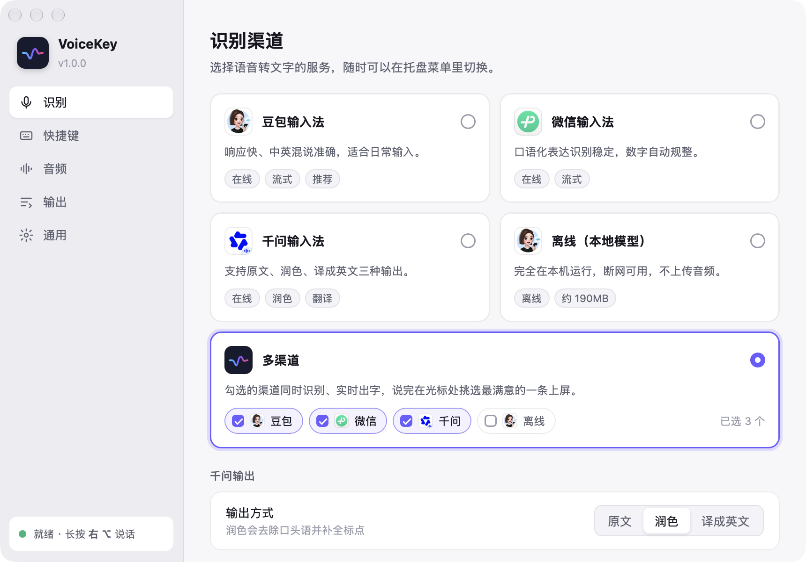

<p align="center"></p>

<h1 align="center">VoiceKey</h1>

<p align="center">macOS / Windows 语音输入：在任意输入框里按住或点按快捷键说话，识别结果直接打到光标处。</p>

<p align="center">
  
  
</p>
<p align="center"><sub>多渠道候选框：说话时各渠道实时出字（左），松开后逐条定稿并显示耗时，数字键或回车选一条上屏（右）</sub></p>

## 功能

- **多个识别渠道**：豆包输入法、微信输入法、千问输入法云端识别，以及完全本地运行的离线识别：微信离线（macOS / Windows）、豆包离线（仅 Apple 芯片 Mac）
- **多渠道候选**：勾选 2 个以上渠道同时识别，光标旁弹出候选框实时显示各渠道结果，按数字键或 ↑↓ + 回车选一条上屏；默认选中上次用的渠道
- **渠道对比**：在设置里录一段话，并排比较各渠道的结果和速度
- **长按说话**：按住快捷键开始，松开结束
- **点按说话**：自定义快捷键，点一下开始，停顿 1–5 秒自动结束，再点一下可提前结束
- **边说边上屏**：识别中的文字实时打到光标处，结束后按定稿修正；关闭后改为结束时一次性粘贴
- **千问输出**：原文、润色或译成英文
- **麦克风选择**、开机启动、浅色 / 深色主题

## 截图

| 识别渠道 | 渠道对比 |
|---|---|
|  |  |

单渠道模式下，屏幕底部显示声波浮层和实时文字：

<p align="center"></p>

## 安装

从 [Releases](https://github.com/J3n5en/voicekey/releases) 下载：

| 系统 | 文件 |
|---|---|
| macOS 13+（Apple 芯片与 Intel 通用） | `VoiceKey-x.y.z.dmg`，打开后拖到「应用程序」 |
| Windows 10/11 x64 | `VoiceKey-x.y.z-x64-setup.exe` 或 `.msi` |

macOS 发布包为 ad-hoc 签名、未经 Apple 公证，首次运行前需解除隔离：

```bash
xattr -dr com.apple.quarantine /Applications/VoiceKey.app
```

旧版原生 Swift 实现（仅 macOS 15+）保留在 [`legacy`](https://github.com/J3n5en/voicekey/tree/legacy) 分支。

## 使用

1. 首次启动会打开引导：授予 **辅助功能**（仅 macOS，用于监听快捷键和上屏）和 **麦克风** 权限，并试说一句
2. 之后常驻菜单栏 / 系统托盘，可在托盘菜单切换渠道、暂停监听、打开设置
3. 在任意输入框中说话

| 设置项 | macOS 默认 | Windows 默认 |
|---|---|---|
| 识别渠道 | 豆包输入法 | 豆包输入法 |
| 长按快捷键 | 右 ⌥ | 右 Alt |
| 点按快捷键 | 右 ⌘ | 右 Ctrl |
| 静音自动结束 | 1.5 秒 | 1.5 秒 |
| 边说边上屏 | 开 | 开 |

单个修饰键可同时作为长按键和点按键：快速点一下为点按，按住超过 0.3 秒为长按。设为组合键的点按快捷键会被拦截，不再传给前台应用。

**离线识别**：首次选择离线渠道时下载模型，之后断网也能用。

- **微信离线**：下载微信输入法官方离线语音包（约 100MB，来自腾讯 CDN），解出模型保存在数据目录的 `wtoffline/` 下；由本项目自己实现的 int8 推理运行，不依赖官方程序，macOS 和 Windows 都可用。
- **豆包离线**（仅 Apple 芯片 Mac）：下载引擎库（约 8MB，来自本仓库 [offline-libs](https://github.com/J3n5en/voicekey/releases/tag/offline-libs) Release）和模型（约 177MB，来自字节 CDN），保存在 `~/Library/Application Support/VoiceKey/offline/`；只在用到时启动后台进程，空闲 5 分钟后自动释放。

## 从源码构建

需要 Rust（stable）、Node 22+ 和 CMake；Windows 另需 MSVC 生成工具。

```bash
cd app
npm ci
npx tauri dev                    # 开发运行
npx tauri build --bundles app    # macOS：target/release/bundle/macos/VoiceKey.app
npx tauri build                  # Windows：nsis / msi 安装包
```

- Opus 由 `audiopus_sys` 从源码静态编译，相关环境变量见 `.cargo/config.toml`
- 打包 DMG：`Scripts/dmg.sh out.dmg path/to/VoiceKey.app app/src-tauri/icons/icon.icns`
- 命令行测试识别：`cargo run -p voicekey-core --bin vk-test -- doubao|wetype|qwen file.wav [asr|polish|translate]`（WAV 需 16kHz 单声道）

## 发布

推送 `v*` 标签后，GitHub Actions 构建 macOS 通用 DMG 与 Windows 安装包并创建 Release：

```bash
git tag v1.0.1 && git push origin v1.0.1
```

## 结构

| 路径 | 内容 |
|---|---|
| `crates/core` | 识别引擎：豆包（protobuf + WebSocket）、微信（secp128r1 ECDH、AES-256-ECB、snappy）、千问（HMAC-SHA1、AES-128-CBC）；音频采集与重采样、Opus 编码 |
| `crates/platform` | 平台层：全局快捷键（CGEventTap / WH_KEYBOARD_LL）、上屏、光标位置、权限 |
| `crates/hanbao` | 离线引擎：编译 `Sources/CHanbao`，在 macOS 进程内加载安卓 ELF 引擎库 |
| `crates/wtlocal` | 微信离线引擎：解析官方 xnet 模型，FBank 特征、int8 矩阵乘（NEON / AVX2）、40 层 Transformer 推理与流式解码 |
| `app/src-tauri` | Tauri 应用：设置、快捷键状态机、会话调度、浮层窗口、托盘、离线资源下载 |
| `app/src` | Svelte 界面：设置、引导、声波浮层、候选框、渠道对比 |
| `design/` | 交互原型与渠道图标 |

音频以 16kHz 单声道、20ms 一帧采集。识别设备身份在本机运行时生成，保存在 `~/Library/Application Support/VoiceKey/`（Windows 为 `%APPDATA%\VoiceKey\`）。

## 声明

本项目通过分析输入法客户端协议实现，仅供学习与个人使用，与字节跳动、腾讯、阿里巴巴无关。接口可能随时变更或失效；语音会发送到对应厂商的服务器。
